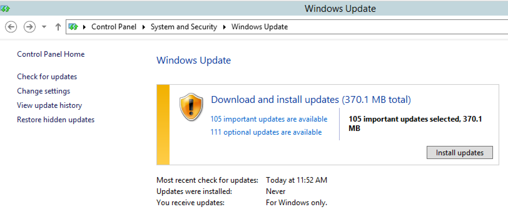
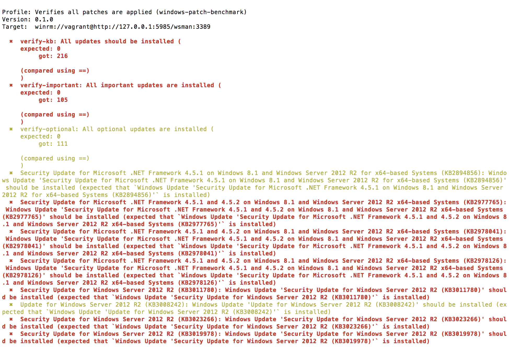
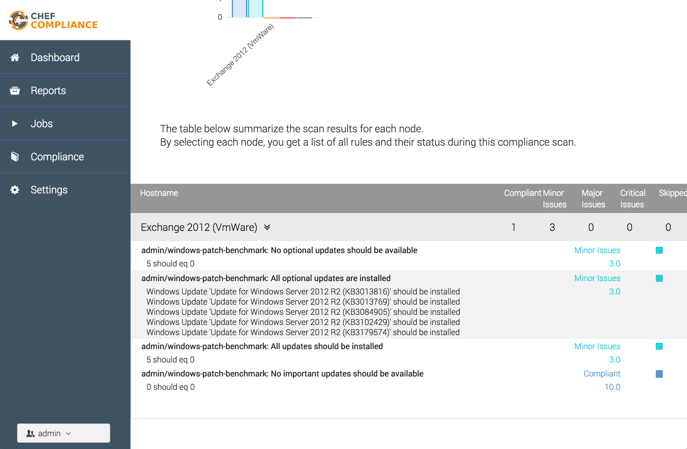

# Windows Patch Benchmark

This [InSpec](http://inspec.io/) profile verifies that all updates have been installed on a Windows machine. This reflects the same information as available via Windows Update:

This profiles enables you to verify the patch-level automatically. The profile returns the following result:

If you require a graphical user interface [Chef Compliance](https://www.chef.io/compliance/) helps you to visualize the information.

## Supported Operating Systems

- Windows 2012 R2
- Windows 2016
- Windows 2016 Nano

## License

|  |  |
| ------ | --- |
| **Author:** | Christoph Hartmann (<chris@lollyrock.com>) |
| **Copyright:** | Christoph Hartmann (<chris@lollyrock.com>) |
| **License:** | Mozilla Public License Version 2.0 |
